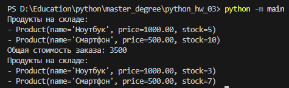

**Запуск программы**
```bash
python -m main
```

**Результат выполнения**



---

**Класс Product**

Атрибуты:
- `name` (строка) - название товара
- `price` (число) - цена товара
- `stock` (целое число) - количество товара на складе

Методы:
- `update_stock(quantity)` - метод, который обновляет количество товара на складе. Если количество становится отрицательным, должно выдаваться сообщение об ошибке

**Класс Order**

Атрибуты:
- `products` (словарь) - словарь, где ключом является объект Product, а значением - количество этого товара в заказе

Методы:
- `add_product(product, quantity)` - метод для добавления товара в заказ. Если товара недостаточно на складе, должно выдаваться сообщение об ошибке
- `calculate_total()` - метод для расчёта общей стоимости заказа

**Класс Store**

Атрибуты:
- `products` (список) - список всех доступных товаров в магазине

Методы:
- `add_product(product)` - метод для добавления товара в магазин
- `list_products()` - метод для отображения всех товаров в магазине с их ценами и количеством на складе
- `create_order()` - метод для создания нового заказа

**Дополнительные задания (выполняется по желанию)**

1. **Реализуйте возможность удаления товаров из заказа**
- Добавьте метод `remove_product(product, quantity)` в класс `Order`, который будет удалять указанное количество товара из заказа. Если количество товара в заказе становится равным нулю, удалите товар из словаря `products`

2. **Добавьте функциональность для обработки возвратов товаров и обновления запасов**
- Реализуйте метод `return_product(product, quantity)` в классе `Order`, который будет возвращать указанный товар обратно в магазин. Этот метод должен:
    - уменьшать количество товара в заказе
    - вызывать метод `update_stock(quantity)` у объекта `Product`, чтобы увеличить количество товара на складе
    - если количество товара в заказе становится равным нулю, удалите товар из словаря `products`
