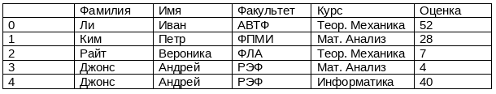

### Домашнее задание 9 к теме 9. Работа с базами данных. FastAPI+SQLAlchemy+Alembic

- **Задание 1**

    В файле [students.csv](./students.csv) дана таблица вида:

    

    Необходимо разработать модель данных для хранения данных из этой таблицы.

    Этапы работы:
    - Опишите модель данных, используя SQLAlchemy
    - Разработайте класс для выполнения операций INSERT и SELECT для полученной модели данных
    - Напишите метод для заполнения модели данными из файла students.csv
    - Напишите методы для:
        - получения списка студентов по названию факультета
        - получения списка уникальных курсов
        - получения среднего балла по факультету
        - получения списка студентов по выбранному курсу с оценкой ниже 30 баллов
